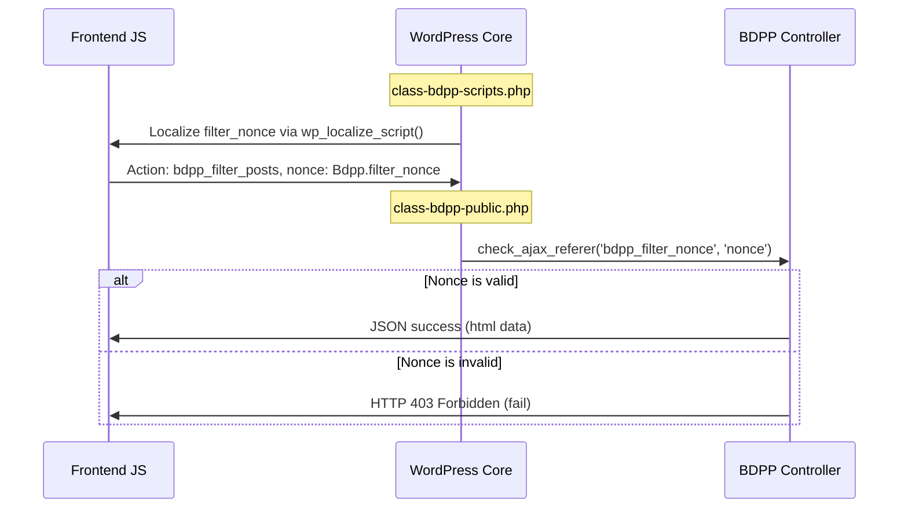

# GG Blogging Engine — Security Posture

This document outlines the security controls, validation boundaries, and threat mitigation patterns in place within the blogging engine codebase.

---

## 1. Nonce Verification & Request Authentication

All client-to-server communications (Ajax filters, pagination triggers, custom listings) must be secured by cryptographically strong, session-bound WordPress nonces.



### Nonce Generation
Nonces are generated in `includes/class-bdpp-scripts.php` and bound to the localized array of public script assets:
```php
'filter_nonce' => wp_create_nonce( 'bdpp_filter_nonce' ),
```

### Nonce Verification
Verification is checked in the public controller method `bdpp_filter_posts` inside `includes/class-bdpp-public.php`:
```php
check_ajax_referer( 'bdpp_filter_nonce', 'nonce' );
```
If validation fails, WordPress immediately terminates execution, returning a `403 Forbidden` response to prevent unauthorized data querying.

---

## 2. Input and Output Sanitization Boundaries

We enforce strict data validation boundaries between the database and the rendering screen:

*   **POST Argument Sanitization**: All variables supplied through HTTP requests are sanitized immediately upon capture:
    *   Category references are passed through `sanitize_text_field()`.
    *   Integer layouts and columns are explicitly cast using `intval()`.
    *   URL pointers are cleaned using `bdp_clean_url()`.
*   **Query Safety**: Dynamic database parameters are bound directly within the structured `WP_Query` arguments array. Direct SQL string concatenations are strictly forbidden to eliminate SQL injection vectors.
*   **Output Escaping**: Before emitting markup, attributes and labels are escaped:
    *   HTML tags are escaped using `esc_html()` or `esc_html__()`.
    *   HTML class wrappers are sanitized with `bdp_sanitize_html_classes()`.
    *   JavaScript and inline variables are filtered using `esc_js()`.
    *   HTML attributes are rendered using `esc_attr()`.

---

## 3. Freemius SDK Status (Removed)

The Freemius SDK has been **surgically removed** from the codebase:
1.  The `freemius.php` entry point file was deleted.
2.  All `include_once( BDP_DIR . '/freemius.php' )` calls were commented out in the main plugin file.
3.  The Freemius directory is no longer present in the plugin.
4.  The core querying, templates, and script enqueues operate independently with zero Freemius dependency.
5.  No telemetry, upgrade prompts, or external pings originate from this plugin.

## 4. Known Security Debt

### 4A. Filter Nonce is Public (Informational)
The `bdpp_filter_posts` Ajax action is registered with both `wp_ajax_` (authenticated) and `wp_ajax_nopriv_` (unauthenticated) hooks. The nonce (`bdpp_filter_nonce`) is exposed to all visitors via the global `Bdpp` JS object. This means the endpoint is effectively public — the nonce provides no access control barrier. This is acceptable for a read-only post filter endpoint but should be noted.

### 4B. Post Type Whitelist Missing in Ajax Handler
The `bdpp_filter_posts()` handler accepts `post_type` from user-supplied JSON with only `sanitize_text_field()` — no whitelist validation against registered public post types. A compromised session with XSS could enumerate private CPT content. Recommended fix: whitelist against `bdp_get_post_types()`.
