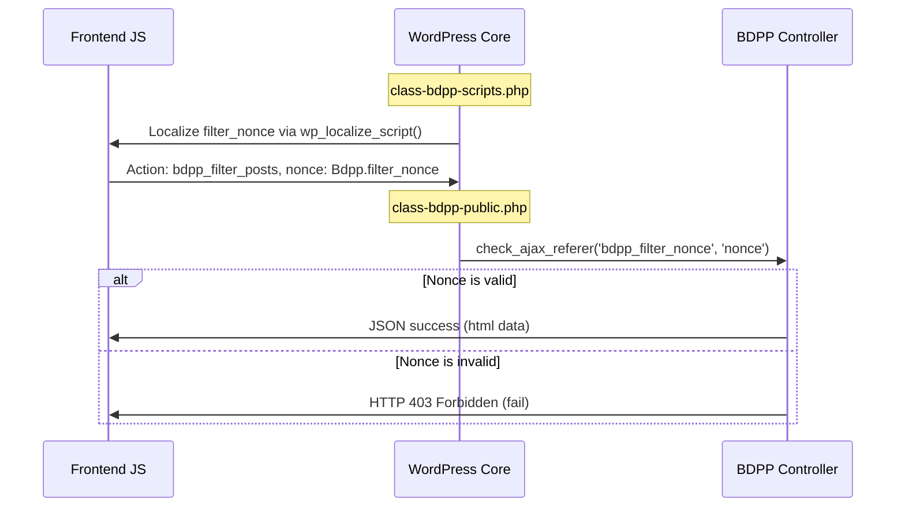

# GG Blogging Engine — Security Posture

This document outlines the security controls, validation boundaries, and threat mitigation patterns in place within the blogging engine codebase.

---

## 1. Nonce Verification & Request Authentication

All client-to-server communications (Ajax filters, pagination triggers, custom listings) must be secured by cryptographically strong, session-bound WordPress nonces.



### Nonce Generation
Nonces are generated in `includes/class-bdpp-scripts.php` and bound to the localized array of public script assets:
```php
'filter_nonce' => wp_create_nonce( 'bdpp_filter_nonce' ),
```

### Nonce Verification
Verification is checked in the public controller method `bdpp_filter_posts` inside `includes/class-bdpp-public.php`:
```php
check_ajax_referer( 'bdpp_filter_nonce', 'nonce' );
```
If validation fails, WordPress immediately terminates execution, returning a `403 Forbidden` response to prevent unauthorized data querying.

---

## 2. Input and Output Sanitization Boundaries

We enforce strict data validation boundaries between the database and the rendering screen:

*   **POST Argument Sanitization**: All variables supplied through HTTP requests are sanitized immediately upon capture:
    *   Category references are passed through `sanitize_text_field()`.
    *   Integer layouts and columns are explicitly cast using `intval()`.
    *   URL pointers are cleaned using `bdp_clean_url()`.
*   **Query Safety**: Dynamic database parameters are bound directly within the structured `WP_Query` arguments array. Direct SQL string concatenations are strictly forbidden to eliminate SQL injection vectors.
*   **Output Escaping**: Before emitting markup, attributes and labels are escaped:
    *   HTML tags are escaped using `esc_html()` or `esc_html__()`.
    *   HTML class wrappers are sanitized with `bdp_sanitize_html_classes()`.
    *   JavaScript and inline variables are filtered using `esc_js()`.
    *   HTML attributes are rendered using `esc_attr()`.

---

## 3. Freemius SDK Boundaries (Deactivation & Clean-up)

Freemius is carried inside the standard codebase as inert code. To minimize vulnerability surfaces and clean up the administrative experience:
1.  **Stripping Notices**: Upgrade messages (`bdpp_premium_admin_messages()`) and premium banners are disabled.
2.  **No Core Logic Reliance**: The core querying, templates, and script enqueues operate completely free of Freemius API hooks.
3.  **Future Fork Clean-up**: In Track D, we will completely sever the Freemius SDK file directories from active execution to guarantee 100% telemetry-free operation.
